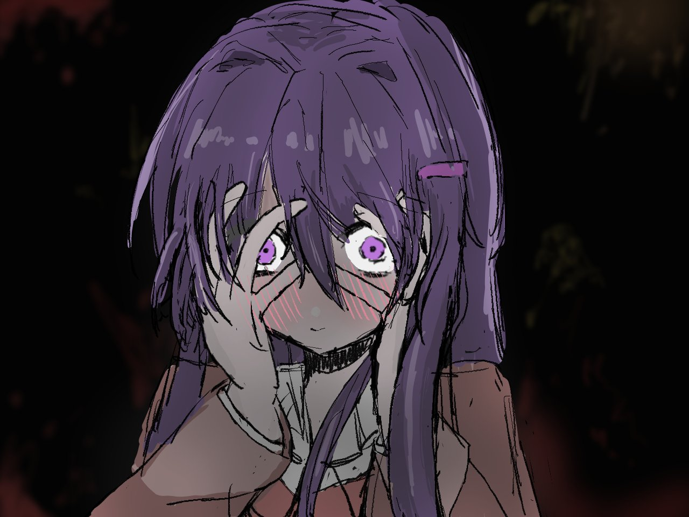

# 阶段 11：图片点击放大复习

## 这一阶段完成了什么

我们让首页头像变成了可交互图片：

- 点击头像可以打开大图。
- 点击右上角的关闭按钮可以关闭大图。
- 按键盘 `Esc` 也可以关闭大图。
- 图片仍然保留了准确的 `alt` 文字。

## 重要原理

### 1. 为什么用 `button` 包住图片

```html
<button class="profile-button" type="button">
  
</button>
```

图片本身主要负责显示内容，按钮负责表达“可以点击”。这样键盘用户也能通过 `Tab` 选中它。

### 2. 原生 `<dialog>`

```html
<dialog class="image-dialog">
  ...
</dialog>
```

`dialog` 是浏览器提供的对话框元素。JavaScript 中：

```javascript
imageDialog.showModal();
```

可以打开带遮罩层的模态框：

```javascript
imageDialog.close();
```

可以关闭它。

### 3. 处理 `Esc` 关闭

浏览器通常会为原生 dialog 提供 `Esc` 关闭行为，但不同环境可能表现不同。我们显式监听 `cancel` 事件：

```javascript
imageDialog.addEventListener("cancel", (event) => {
  event.preventDefault();
  imageDialog.close();
});
```

这样既保留原生键盘行为，也明确保证按 `Esc` 时会调用 `close()`。

另外，脚本还监听了 `document` 的 `keydown` 事件作为兼容处理：

```javascript
document.addEventListener("keydown", (event) => {
  if (event.key === "Escape" && imageDialog.open) {
    imageDialog.close();
  }
});
```

### 4. `::backdrop`

```css
.image-dialog::backdrop {
  background: rgb(15 23 42 / 75%);
}
```

`::backdrop` 用来设置对话框后面的遮罩层。背景变暗后，用户会更容易注意到正在查看的大图。

## 如何复现本阶段

1. 用按钮包住需要点击的图片。
2. 添加一个 `dialog` 和关闭按钮。
3. 点击图片时调用 `showModal()`。
4. 点击关闭按钮时调用 `close()`。
5. 用 `::backdrop` 设置背景遮罩。
6. 测试鼠标点击、键盘 `Tab` 和 `Esc`。

## 本阶段练习

1. 修改关闭按钮的颜色。
2. 把头像边框改成不同样式。
3. 点击头像打开大图，再按 `Esc` 关闭。
4. 用键盘 `Tab` 选中头像和关闭按钮。
5. 切换深色模式后再打开大图。

## 发布更新

上传：

- `index.html`
- `style.css`
- `script.js`

## 记住这句话

**可访问的交互不仅要能用鼠标点击，也要能用键盘操作。**
